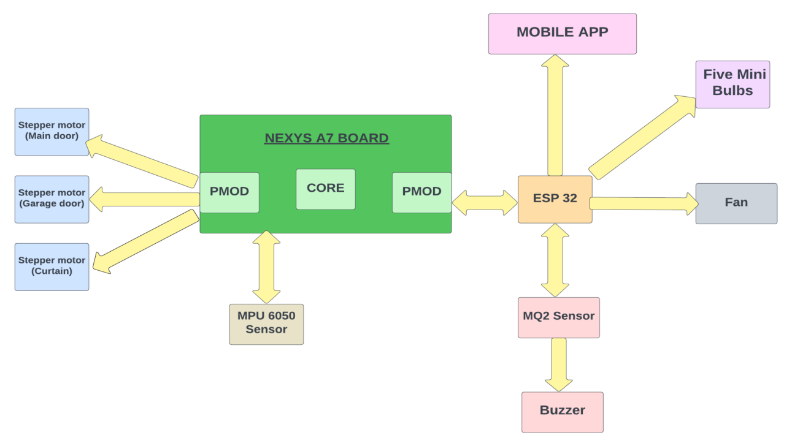

# IoT based Home Automation System
## Project Overview
This project aims to design and implement a scalable and efficient home automation system using FPGA technology and an Android application. 
It allows users to remotely control and monitor home appliances, lighting, and other devices through a user-friendly interface. 

## Features
- Remote Control: Control and monitor devices via an Android app.
- Device Integration: Supports a range of devices including fans, stepper motors, and sensors.
- User Notifications: Provides alerts like fire alerts via text.

## Hardware Components
- Nexys A7 FPGA
- ESP32 WiFi Module
- 28BYJ-48 Stepper motors with ULN2003 Driver
- MPU 6050 sensor
- Mini Bulbs, Buzzer, Relay Module
- Fan
- Wires
- Android Device
- MQ2 sensor
  
## Software Tools
- Vivado: For RTL and embedded design development.
- Vitis: For firmware design.
- Android Studio: For application development.
- Arduino IDE: For programming the ESP32.
- Logic Analyzer and Putty for diagnostics.
  
## Installation
- Set up FPGA Board: Initialize the Nexys A7 FPGA board as per the schematic provided in the documentation.
- Install Software: Install Vivado, Vitis, and Android Studio on your development machine.
- Program ESP32: Use Arduino IDE to program the ESP32 with the provided firmware.
  
## Usage
- Android App: Use the Android application to control and monitor devices.
- MQTT Server: Connect the devices to the MQTT server as detailed in the setup guide.
- Sensor Monitoring: Monitor sensors directly from the app for real-time updates.

  

  
## Datasheets
- Refer to the detailed datasheets included in the project report for specifications and operational guidelines of each hardware component used.

## Problems Faced
- Issues with data transmission through ESP32 and stepper motor control.
- Integration challenges across different hardware components.

## Datasheets and Further Reading

- **ESP32 Overview and Setup**
  - [Getting Started with ESP32](https://randomnerdtutorials.com/getting-started-with-esp32/)
  
- **Stepper Motor Information**
  - [28BYJ-48 Stepper Motor Arduino Tutorial](https://lastminuteengineers.com/28byj48-stepper-motor-arduino-tutorial/)
  - [Control 28BYJ-48 Stepper Motor with ULN2003 Driver](https://www.circuits-diy.com/control-28byj-48-stepper-motor-with-uln2003-driver/)

- **MPU6050 Sensor Details**
  - [MPU6050 Accelerometer and Gyro Tutorial](https://lastminuteengineers.com/mpu6050-accel-gyro-arduino-tutorial/#:~:text=The%20MPU6050%20includes%20an%20embedded,itself%2C%20not%20the%20ambient%20temperature)

- **Android App Development**
  - [Android Navigation Design Actions](https://developer.android.com/guide/navigation/design/actions)
  - [Navigating Android Fragments with the Navigation Component](https://medium.com/@mr.appbuilder/navigating-android-fragments-with-the-navigation-component-part-1-1d238e000313)
 
- ## Reference Links
These links provide additional context and tutorials for components and technologies used in the project:
- [Random Nerd Tutorials - ESP32](https://randomnerdtutorials.com/getting-started-with-esp32/)
- [Last Minute Engineers - Stepper Motor Tutorial](https://lastminuteengineers.com/28byj48-stepper-motor-arduino-tutorial/)
- [Circuits DIY - Stepper Motor Control](https://www.circuits-diy.com/control-28byj-48-stepper-motor-with-uln2003-driver/)
- [Last Minute Engineers - MPU6050 Tutorial](https://lastminuteengineers.com/mpu6050-accel-gyro-arduino-tutorial/)
- [Android Developer Guide - Navigation Actions](https://developer.android.com/guide/navigation/design/actions)
- [Medium - Android Fragments Navigation](https://medium.com/@mr.appbuilder/navigating-android-fragments-with-the-navigation-component-part-1-1d238e000313)
